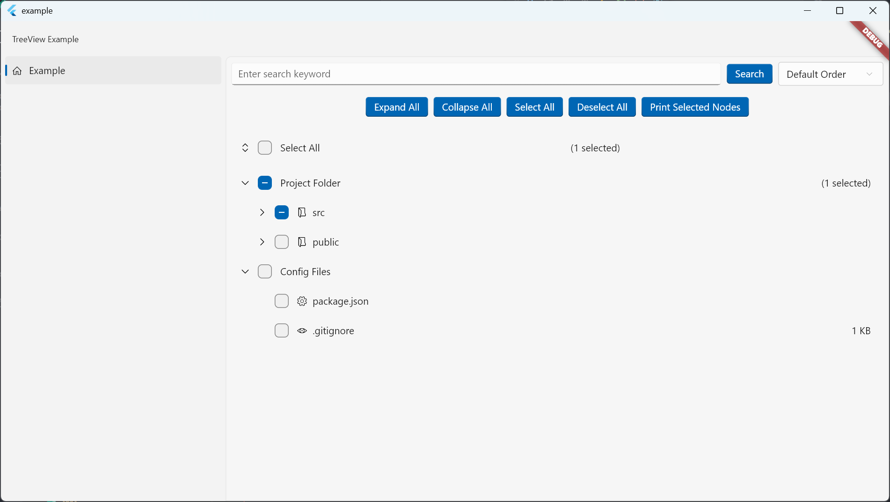

# Checkable FluentTreeView

fluent design for [Checkable TreeView](https://pub.dev/packages/checkable_treeview)

[](https://github.com/monkeyWie/flutter_treeview/blob/main/LICENSE)
<a title="Made with Fluent Design" href="https://github.com/bdlukaa/fluent_ui">
  
</a>

A checkable and customizable tree view widget for Flutter.

## Screenshot



## Features

- Hierarchical data display
- Node selection with multi-select support
- Expandable/collapsible nodes
- Filtering and sorting capabilities
- Customizable node appearance
- "Select All" functionality
- Expand/Collapse all nodes option

## Getting Started

To use the FluentTreeView widget in your Flutter project, follow these steps:

Manually install the plug-in
```
dependencies:
  checkable_treeview_fluent:
    git:
      url: https://github.com/Minessential/flutter_treeview_fluent.git
```

## Usage

Here's a basic example of how to use the FluentTreeView widget:

```dart
import 'package:fluent_ui/fluent_ui.dart';
import 'package:checkable_treeview/checkable_treeview.dart';

void main() {
  runApp(MyApp());
}

class MyApp extends StatelessWidget {
  @override
  Widget build(BuildContext context) {
    return FluentApp(
      home: NavigationView(
        appBar: const NavigationAppBar(
          automaticallyImplyLeading: false,
          title: Text('FluentTreeView Example'),
        ),
        pane: NavigationPane(
          selected: 0,
          displayMode: PaneDisplayMode.auto,
          items: [
            PaneItem(
              icon: const Icon(FluentIcons.home),
              title: const Text('Example'),
              body: FluentTreeView<String>(
                nodes: [
                  FluentTreeNode(
                    label: const Text('Root'),
                    value: 'root',
                    icon: const Icon(FluentIcons.folder),
                    children: [
                      FluentTreeNode(label: const Text('Child 1'), value: 'child1'),
                      FluentTreeNode(label: const Text('Child 2'), value: 'child2'),
                    ],
                  ),
                ],
                onSelectionChanged: (selectedValues) {
                  print('Selected values: $selectedValues');
                },
              ),
            ),
          ],
        ),
      ),
    );
  }
}
```

## Customization

The FluentTreeView widget offers various customization options:

- `showSelectAll`: Enable/disable the "Select All" checkbox
- `selectAllWidget`: Custom widget for the "Select All" option
- `showExpandCollapseButton`: Show/hide expand/collapse buttons
- `initialExpandedLevels`: Set the initial number of expanded levels

For more advanced customization, refer to the API documentation.

## Advanced Features

### Filtering

To implement filtering, use the `filter` method of the `FluentTreeViewState`:

```dart

final treeViewKey = GlobalKey<FluentTreeViewState<String>>();

treeViewKey.currentState?.filter('search keyword');
```

### Sorting

To implement sorting, use the `sort` method of the `FluentTreeViewState`:

```dart
final treeViewKey = GlobalKey<FluentTreeViewState<String>>();

treeViewKey.currentState?.sort((a, b) => a.label.compareTo(b.label));
```

### Set Select All

To set the select all state, use the `setSelectAll` method of the `FluentTreeViewState`:

```dart
final treeViewKey = GlobalKey<FluentTreeViewState<String>>();

treeViewKey.currentState?.setSelectAll(true);
```

### Expand/Collapse All

To expand or collapse all nodes, use the `expandAll` and `collapseAll` methods of the `FluentTreeViewState`:

```dart
final treeViewKey = GlobalKey<FluentTreeViewState<String>>();

treeViewKey.currentState?.expandAll();
treeViewKey.currentState?.collapseAll();
```

### Get Selected Nodes

To get the selected nodes, use the `getSelectedNodes` method of the `FluentTreeViewState`:

```dart
final treeViewKey = GlobalKey<FluentTreeViewState<String>>();

final selectedNodes = treeViewKey.currentState?.getSelectedNodes();
```

### Get Selected Values

To get the selected values, use the `getSelectedValues` method of the `FluentTreeViewState`:

```dart
final treeViewKey = GlobalKey<FluentTreeViewState<String>>();

final selectedValues = treeViewKey.currentState?.getSelectedValues();
```

## Contributing

Contributions are welcome! Please feel free to submit a Pull Request.

## License

This project is licensed under the MIT License - see the [LICENSE](LICENSE) file for details.
